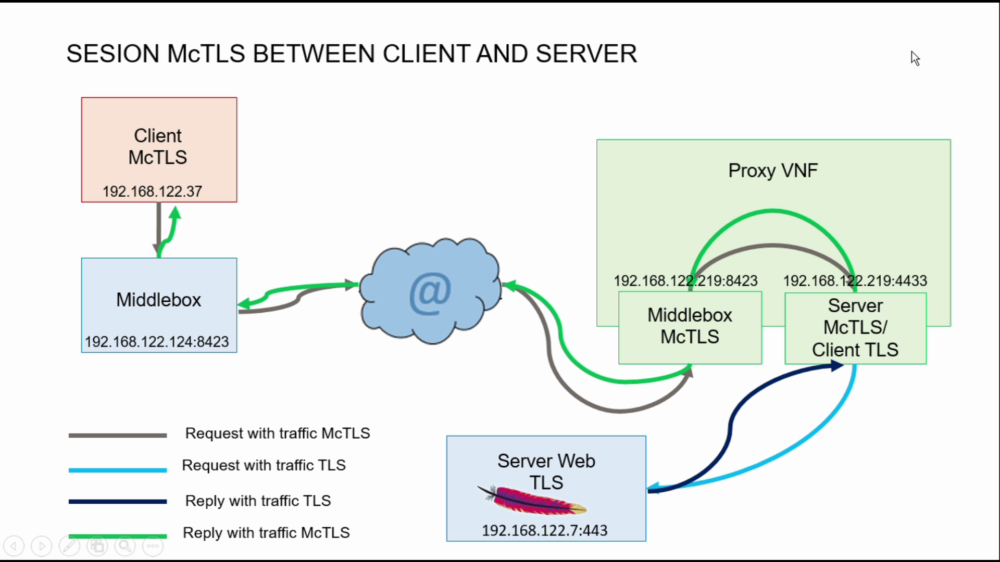

# mcsVNF
Some VNFs used for the demonstration of multi-context security approaches, and how they can interact within a datacenter environment and beyond.
The VNFs provide clients, servers based on the original multi-context TLS proposal, as well as a gateway for interworking through pure TLS connections. Support from different methods for key and certificate management (including ACME) is provided.

## VNFs setup:
### Requirements:
* Ubuntu 14.04 LTS Server
* [mcTLS](https://github.com/scoky/mctls) or  *mctls* local repository folder

### Installation
Next figure shows the layout. with 3 VM: One client, one Web server and the mcTLS Proxy VNFs for datacenter. 

1. Install Ubuntu and mcTLS in each VM. 
2. Install Apache Web server in Server VM
3. Upload the files into corresponding VM.
4. Recompile mcTLS Proxy VNF with new uploaded code. Following  [mcTLS install](https://github.com/scoky/mctls/blob/master/INSTALL) process.

## Files to upload

### Standard web server VM (server) 
Copy files from *server* local repository folder
and start Apache2 Server with TLS1.2 support.

## Middlebox VNF (proxymcTLS)
Copy files from *proxymcTLS* local repository folder
This is the core VNF that includes several components:
* mcTLS middlebox based on original [Mctls](https://github.com/scoky/mctls)
* mcTLS proxy. Modified version of the original [Mctls](https://github.com/scoky/mctls) Server with proxy functionality: End mcTLS session, extract HTTP payload and encapsulate it in a standard TLS session
* TLS client

## Client (client)
Copy files from *client* local repositoryfolder
and use [Mctls](https://github.com/scoky/mctls) command line client

## Use:
1. Update configuration files 
2. Move to evaluation folder 
2. Start process in the following order:
  * Server
  * proxyTLS (middlebox & proxy)
2. Run test from client.

